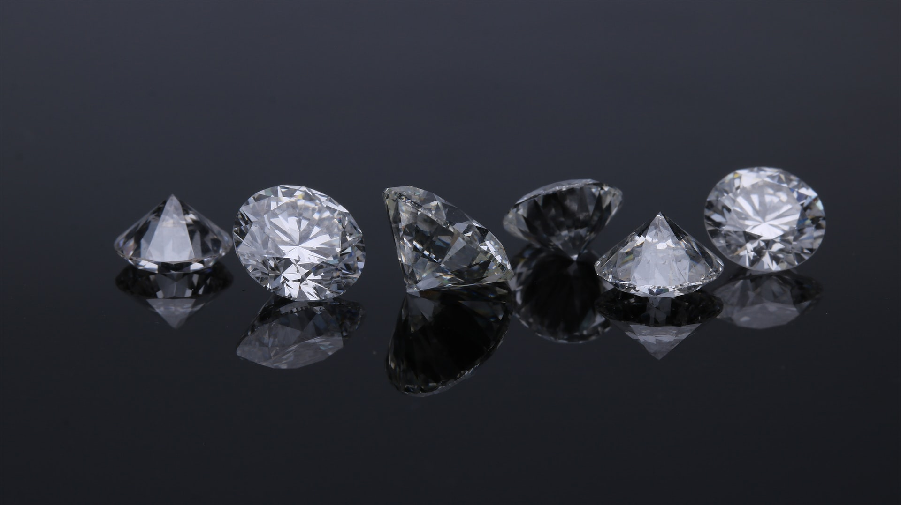
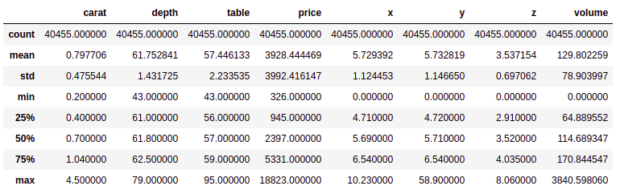

# ih_datamadpt1120_project_m2
Ironhack Madrid - Data Analytics Part Time - February 2021 - Project Module 2


# **Breaking into the diamond market**
This project consists of an analysis of the the dataset 'diamonds_train.csv' (included in data folder) in order to study the different features of the diamonds and how they affect in the price and between each other. The aim is to reach conclusions that will help us to understand the diamond market in terms of how to make the best deal. 

An extra bonus study has been performed, based on statistical hypotheses testing, comparing the different features of the diamonds in different samples.


<p align="center">

</p>


## **First steps in the study**
The dataset 'diamonds_train.csv' contains 40454 rows of different diamonds and 10 columns with the following features:

- **Carat**: The weight of the diamond.
- **Cut**: Quality of the angles, proportions, facets, and finishing details. The cuts are classified from worst to best quality as: Fair --> Good --> Very Good --> Premium --> Ideal.
- **Color**: How colorless the diamond is. They are classified from less to more colourless as: J --> I --> H --> G --> F --> E --> D.
- **Clarity**: How clean the diamond is of inclusions and blemishes. They are classified from wort to best as: I1 --> SI2 --> SI1 --> VS2 --> VS1 --> VVS2 --> VVS1 --> IF
The meaning of these acronyms is:

FL (Flawless)
IF (Internally Flawless)
VVS1 (Very, Very Slightly Included 1)
VVS2 (Very, Very Slightly Included 2)
VS1 (Very Slightly Included 1)
VS2 (Very Slightly Included 2)
SI1 (Slightly Included 1)
SI2 (Slightly Included 2)
I1 (Inclusions 1)
I2 (Inclusions 2)
- **Depth**: Measurement from top to bottom, expressed as a percentage.
- **Table**: It is the width of the flat facet on its surface, expressed as a percentage.
- **Price**: Price in USD
- **x, y, z**: measures of the diamond in mm

A new column 'volume' is created, multiplying measures x*y*z to obtain the relative volume of the diamond in mm3


First of all, to get an slight view of the dataset, we create a table with some basic statistical details of the data, like maximum, minimum, percentile, mean, std etc. You can see it below.

<p align="center">

</p>


## **Price, what matters?**

For diamonds, as everything in the world, what matters most is the price. We want to center our analysis in how the price of the diamonds varies according to their characteristics, and which of these features has the most influence.

After comparing every feature with the price in a group of bar and scatter graphs, the only features that show a clear lineal relationship with the price are carat and the measures x, y and z (and consequently the volume). 

<p align="center">

</p>

This fact suggests that the most influent feature is the size of the carat (the size is proportional to weight).

Althougth this is a decisive discovery, further analyses are necessary to ensure the statement.


:warning: Please be aware of the python version you are using and the libraries you need to have installed. See "Technology stack" section.

In console write down --> python main.py  --> You will get the result for all countries. Other way could be --> python main.py --country "all"

In console write down --> python main.py -co 'Country name' --> You will get the result for the country you wrote. 
Other way could be --> python main.py --country 'Country name'

Yo can choose any of the following countries: 'Belgium', 'Greece', 'Lithuania', 'Portugal', 'Bulgaria', 'Spain', 'Luxembourg', 'Romania', 'Czechia', 'France', 'Hungary', 'Slovenia', 'Denmark', 'Croatia', 'Malta', 'Slovakia', 'Germany', 'Italy', 'Netherlands', 'Finland', 'Estonia', 'Cyprus', 'Austria', 'Sweden', 'Ireland', 'Latvia', 'Poland' and 'Great Britain'. 
Don't forget to use ''!! 

The results would be printed in console as well as in a Table_'country'.csv file in Results folder, in order to use them for later analyses. The table obtained will be similar to this:

| Country | Job Title | Gender | Quantity | Percentage |
|---|---|---|---|---|
| Austria | Data Administrator| Male | 4 | 6% |
| Austria | Data Administrator| Female | 3 | 4% |
| ... | ... | ... | ... | ... |


To get the bonus information it is just needed to add the following command in console --> python main.py --country 'Country name' --bonus1 y . Other way could be --> python main.py --country 'Country name' -b1 y.

The rable resulted looks like this:

| Position | Number of Pro Arguments | Number of Cons Arguments |
|---|---|---|
| Against | 0 | 2 |
| In Favor | 1 | 1 |

## **Conclusions**

- The price of a diamond is lineal relationed with its carat (and consequently with the volume). This fact justifies why ordinary people consider the carat as the most important feature in a diamond.
- Diamonds with cut 'D' and clarity 'IF' are the most expensive, as they have mostly the best cut ('Ideal'), have a relatively high carat and a low quantity available.
- The table and the depth of a diamond has a inverse lineal relationship. This creates a perfect diamond shape to enhance the shine.


Here you can find the Tableau dashboard with a resume of the most important data achieved --> [Dashboard](https://public.tableau.com/profile/maria.victoria.viana.colino#!/vizhome/ih_datamadpt1120_project_m2-Diamonds/DashboardDiamonds?publish=yes)


## **Technology stack**

- **Programming Language**: Python 3.8
- **Libraries in Use**: pandas, numpy, argparse, sqlalchemy, requests, beautifulsoup4, functools.


## **Folder structure**
```
└── ih_datamadpt1120_project_m1
    ├── __trash__
    ├── .gitignore
    ├── requirements.txt
    ├── README.md
    ├── main.py
    ├── p_acquisition
    │   ├── __init__.py
    │   └── m_acquisition.py
    ├── p_analysis
    │   ├── __init__.py
    │   └── m_analysis.py
    ├── p_wrangling
    │   ├── __init__.py
    │   └── m_wrangling.py
    ├── Results
    │   ├── Table_all.csv  
    │   └── Table_b1_all.csv
    └── data
        └── raw_data_project_m1.db
```     
   
     
## **Next steps**
 - It would be a good upgrade to improve the loop of acquisition API data to get the information faster.
 - There is needed a modification of bonus 1 functions in order to avoid warnings and get a more efficient code.
 

 
